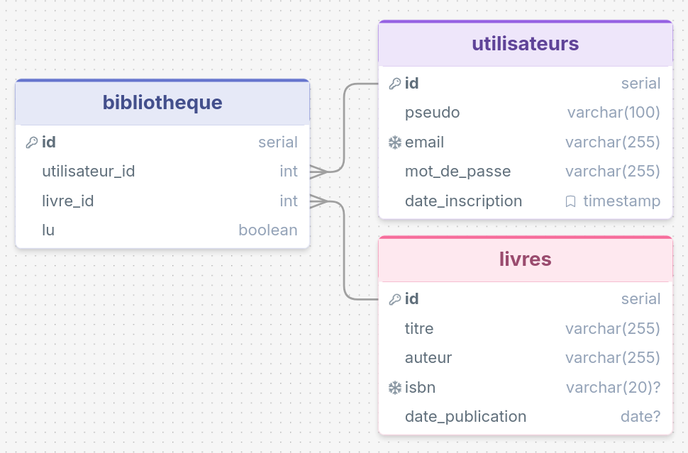

# Bibliotheque

## Description

## Organisation projet

La base de données : 



L'api permet de créer un utilisateur. Ajouter un livre grâce a son ISBN. Ajouter un livre à la bibliothèque d'un utilisateur, et le marquer comme lu si tels quel. 


## Sauvegarde et restauration

Sauvegardes PostgreSQL chiffrées avec Restic, stockées localement sur le VPS,
planification quotidienne et test mensuel de restauration : [procédure](ops/BACKUPS.md).

## Déploiement HTTPS

Sur le VPS, renseigner `API_DOMAIN` et `FRONT_DOMAIN` puis lancer `./start.sh --production` pour
activer Caddy et HTTPS automatique : [procédure](ops/HTTPS.md).
Le démarrage local reste `./start.sh` ; le frontend compilé est servi sur `http://localhost:4321`.

## Authentification par cookie

`POST /v1/auth/login` renvoie `{ "expires_in": 3600 }` et place le JWT dans
le cookie `bibliotheque_session` (HttpOnly, chemin `/v1`, durée
une heure, sans Domain). Le JWT n'est plus exposé dans le JSON et les routes
protégées utilisent ce cookie, sans en-tête Authorization.

Depuis le frontend, utiliser `credentials: 'include'` pour la connexion **et**
les appels suivants :

```js
await fetch(`${apiUrl}/v1/auth/login`, {
  method: 'POST',
  credentials: 'include',
  headers: { 'Content-Type': 'application/json' },
  body: JSON.stringify({ email, mot_de_passe }),
});
```

`POST /v1/auth/logout` et `/v1/auth/logout-all` révoquent les sessions et effacent
le cookie. Swagger utilise automatiquement le cookie après un appel à login.
Les origines autorisées pour CORS et la protection CSRF sont définies ensemble
dans `api/src/auth/csrf.guard.ts`.

En production ou lorsque l'API reçoit une requête HTTPS, le cookie utilise
`SameSite=None; Secure`, ce qui permet notamment un frontend local autorisé
(`http://localhost:4321`) appelant l'API distante en HTTPS. La protection CSRF
continue à vérifier l'origine des requêtes qui modifient des données.

Pour tester entièrement en HTTP local, utiliser `NODE_ENV=development` : le
cookie utilise alors `SameSite=Lax` sans `Secure`. Accéder au frontend et à
l'API avec le même nom d'hôte (`localhost` pour les deux).

Si le navigateur bloque les cookies tiers, `SameSite=None` ne suffit pas :
servir le frontend et l'API sur le même site (même protocole et même domaine
enregistrable, sous-domaines possibles), ou utiliser un proxy du frontend vers l'API.

## Ajout au catalogue avec preuve signée

1. Se connecter, puis appeler `POST /v1/livres/isbn` avec `{ "isbn": "9791035805340" }`.
   Le serveur consulte la base puis le script Python si nécessaire. La réponse
   reste `{ "title": "…", "authors": ["…"] }`. Un cookie `bibliotheque_book`
   HttpOnly contient les informations signées, avec une durée de 10 minutes.
2. Confirmer avec `POST /v1/livres` et le même `{ "isbn": "9791035805340" }`.
   Le navigateur transmet les cookies avec `credentials: 'include'`.
   Le serveur vérifie signature, expiration, audience, utilisateur, session et
   correspondance ISBN, puis insère uniquement les données signées.

Le titre et l'auteur envoyés dans le corps sont désormais refusés (`400`).
Une preuve absente, altérée, expirée ou liée à une autre session/ISBN produit
une erreur `403` au format Problem Details. Une session invalide produit `401`.
Les informations incomplètes ou trop longues ne produisent pas de preuve (`422`).
Un ISBN déjà enregistré produit `409`.

Une seule recherche est conservée par navigateur : une autre recherche remplace
le cookie. Le corps ISBN évite de confirmer par erreur un autre livre depuis un
second onglet. Le cookie est effacé après l'ajout ; une copie du JWT reste
cryptographiquement valide jusqu'à expiration, mais la contrainte ISBN unique
empêche un second ajout du même ISBN. Le JWT est signé, pas chiffré.

`GET /v1/livres/isbn/:isbn` reste une consultation sans génération de preuve.
Le frontend affiche les données en lecture seule avant confirmation. Le dossier
`api/python_script` reste inchangé.
